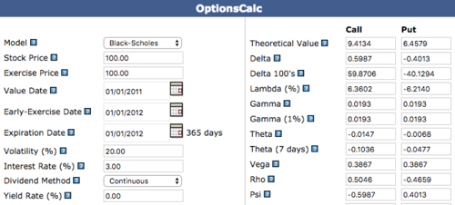
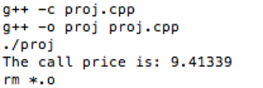
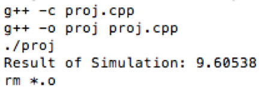
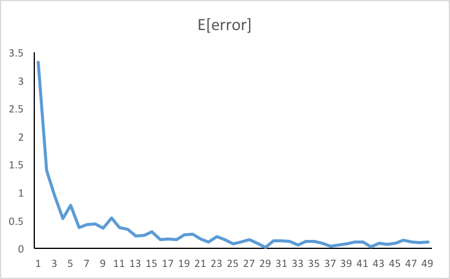
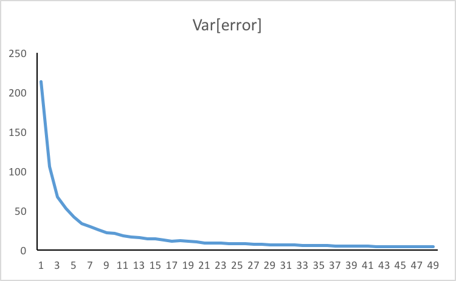

This is a user document for the final project of ORIE 5600. It validates the program by comparing with theoretical values and gives assisstance for Linux users.

## Pricing of Options

The function **call()** prices a European option using Black-Scholes Formula, and **Delta()** produces the greek "delta". In order to aviod too much input parameters, the data needed by BSM are defined as member variables of the **Option** class. 

In additions, function **ExpectedDiscountedPayoffPTilde()** is another way of pricing a European Option by Monte-Carlo simulation. We use a set of data: S=100, K=100, T=1, t=0, alpha=0.08, r=0.03. Comparing the result of the website <http://www.fintools.com/resources/online-calculators/options-calcs/options-calculator/> and the output, we validates these two functions.  
  



## Dynamic Hedging
In order to simulate a dynamic hedging process, we implement the function **hedge(n)**, in which n is the number of times the portfolio rebalances. By increase n from 1 to 50, the program gives our the plot of expectations and variances of hedging errors. (In this senario, we adopt the same parameters as above)  
  


## User Manuscript
There are three entries in the main() function that can call different functions. Uncomment one of them to do the Black-Scholes, Monte-Carlo and dynamic hedging respectively.  
```{C++}
cout << call() << endl;  // 1
cout << ExpectedDiscountedPayoffPTilde() << endl;  // 2
for (int n=1; n<50; n++){
  v = op.hedge(n);
  myfile << -v[0] << "," << v[1] << endl;
}  //3
```

After modifying the source code for certain purpose, open Linux shell to the directory, and type **make** to compile and run the program. 
```{UNIX}
> cd /Project
> make
```

There is also a executable file attached and can be run by that instrucution:
```{UNIX}
> ./proj
```